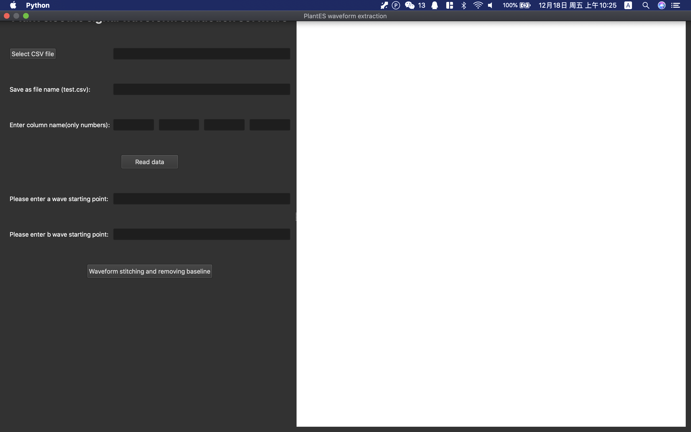
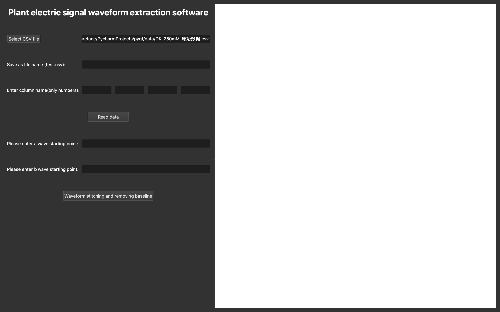
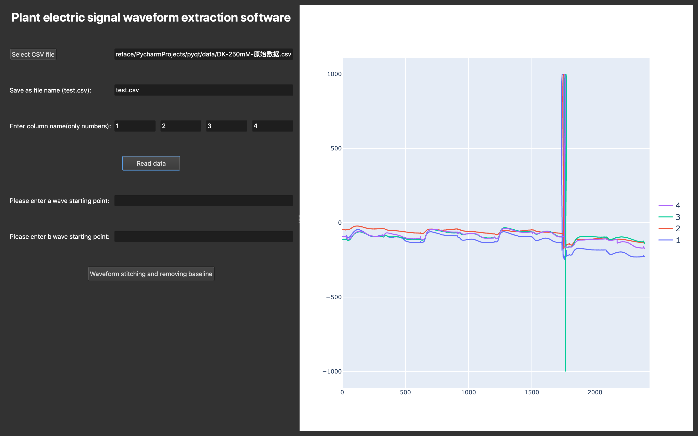
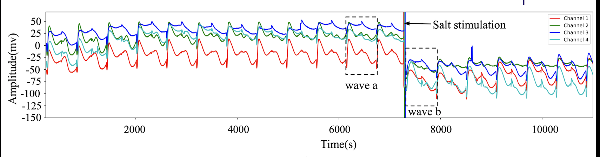
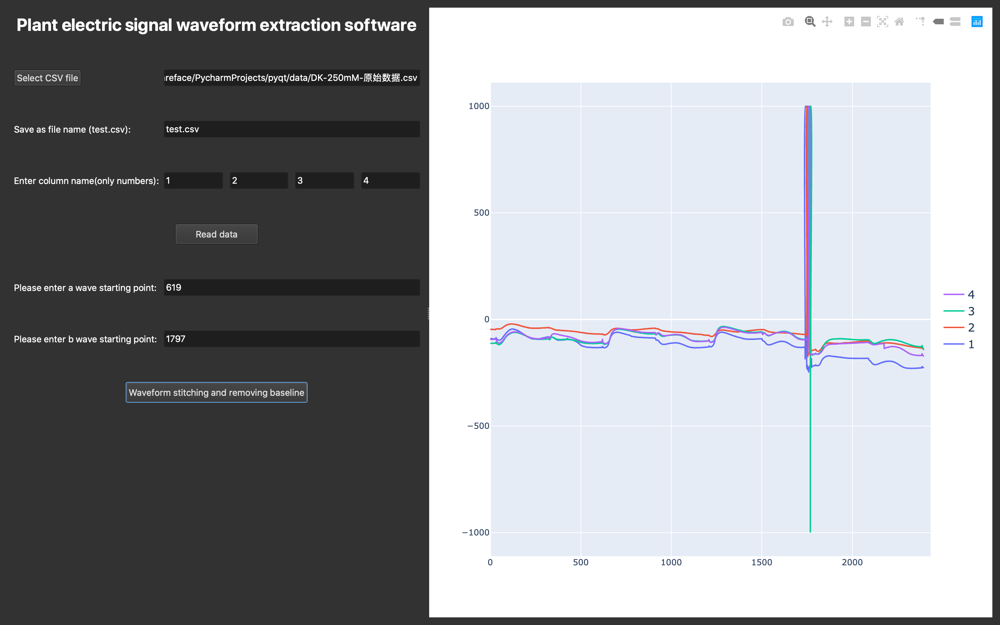
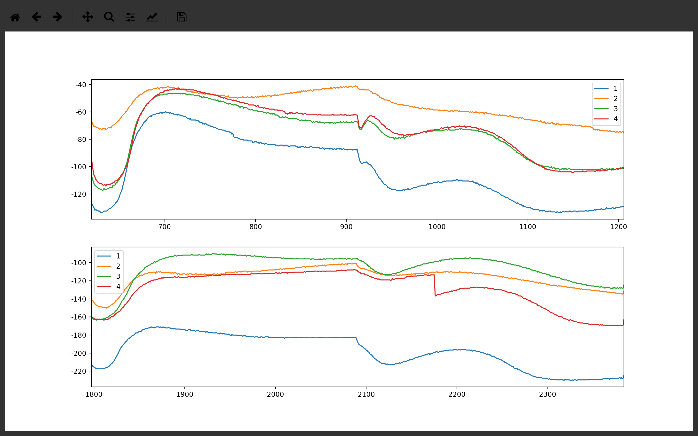
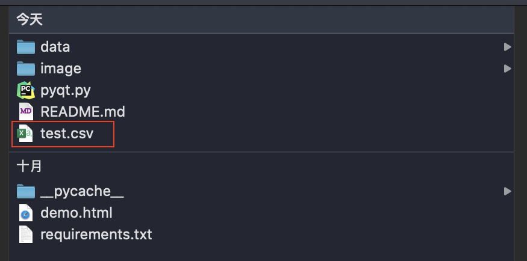

# Stups：
1. install package
```
pip3 install -r requirements.txt
pip3 install pyqtwebengine
```
2. run 
```
python3 pyqt.py
```

# Tutorial
 
### 1. Click the Select CSV file button to select a csv file.  

  

### 2. Enter the name of the file saved after processing in the input box.
 

### 3. Enter the column name of the read file in the input box, for example: 1 2 3 4.

### 4. Click the Read data button to visualize the data based on the column name.

 


### 5. Refer to the schematic diagram of Wave ab in the figure below, the starting point of the ab wave selected by zooming in the waveform in the software window.

 
### 6. Click the Waveform stitching and removing baseline button to start waveform extraction and result saving.

  
### 7. Visualize the extracted wave ab.
  
### 8. The decomposition results are saved in the local directory.



